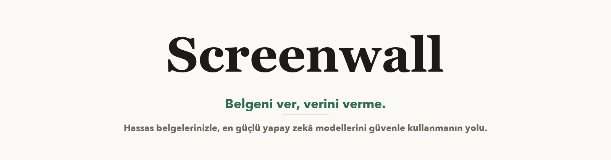
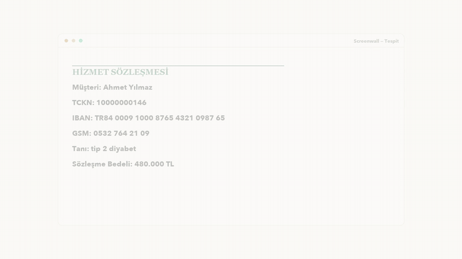

<div align="center">



[](backend/tests)
[](#testler-neyi-test-ediyor)
[](backend/pyproject.toml)
[](#kurulum)



[▶ 42 saniyelik tanıtım videosu](screenwall-promo.mp4) · [Yatırımcı sunumu (PPTX)](Screenwall-Yatirimci-Sunum.pptx)

</div>

---

## Bu ne işe yarıyor?

Bir sözleşmeyi ya da bordroyu ChatGPT'ye yapıştırdığınızda içindeki TC kimlik numaraları,
adlar, IBAN'lar da gidiyor ve geri alma şansınız yok. Screenwall bunun önüne geçmek için
yazıldı: belge kendi bilgisayarınızda taranıyor, kişisel veriler `<PERSON_1>` gibi etiketlerle
değiştiriliyor ve dışarıya yalnızca bu maskelenmiş kopya çıkıyor.

Sistemin bir huyu var, bilerek böyle: emin olamadığı belgeyi onaylamıyor, size soruyor.
Yanlışlıkla bir şey maskelediyse de tek tıkla geri alabiliyorsunuz.

PDF, Word ve Excel destekleniyor; tablolar, üstbilgi/altbilgiler, hücre açıklamaları ve
taranmış sayfalar (OCR ile) dahil. Türkçe için ayrıca uğraştık: TCKN checksum doğrulaması,
GSM/IBAN/plaka kalıpları, sağlık ve engellilik ifadeleri, İ/ı büyük-küçük harf tuzakları.

## Hangi teknolojiler kullanılıyor?

| Katman | Ne kullandık | Ne için |
|---|---|---|
| Tespit 1 | [Microsoft Presidio](https://microsoft.github.io/presidio/) + [spaCy](https://spacy.io) | Kural + istatistik tabanlı PII tespiti (İngilizce `en_core_web_sm`, çok dilli `xx_ent_wiki_sm`) |
| Tespit 2 | 15 özel Türkçe tanıyıcı (bu repoda) | TCKN, IBAN, GSM, plaka, adres, maaş bandı, sağlık/engellilik… Presidio'nun Türkçe'de göremediklerini kapatıyor |
| Tespit 3 | [OpenMed Privacy Filter](https://huggingface.co/OpenMed) (transformers/torch, tamamen yerel) | Bağlamdan anlayan model — kural tabanlıların kaçırdığı serbest metin adları için |
| Denetçi | Qwen 2.5 ([Ollama](https://ollama.com) üzerinden, yerel) + deterministik kontroller | Maskelenmiş kopyada kalıntı var mı diye ikinci göz |
| Belge işleme | PyMuPDF, python-docx, openpyxl, Tesseract (OCR) | PDF/DOCX/XLSX okuma-yazma, taranmış sayfa metni |
| Backend | Python 3.12, FastAPI, uv | API ve işlem hattı |
| Arayüz | React 18 + Vite + TypeScript | Yükleme, inceleme, geri alma, sohbet ekranları |

Hepsi yerelde çalışıyor; belge onaylanmadan önce hiçbir dış servise istek atılmıyor.

## Testler neyi test ediyor?

Bu bölümü biraz uzun tuttuk çünkü "%100 başarı" tek başına bir şey ifade etmiyor —
neyin üzerinde ölçüldüğünü bilmek gerekiyor.

### Test belgeleri (korpus) nereden geliyor?

Gerçek insanların belgelerini test için kullanamayız; bu yüzden **240 sentetik belge**
ürettik. Sentetik ama gelişigüzel değil: altı gerçek belge türünü taklit ediyorlar —
iş sözleşmesi, İK özlük dosyası, sağlık raporu, banka yazışması, kamu dilekçesi ve müşteri
e-postası. İçlerindeki kişiler, TCKN'ler (checksum'ı tutan sahte numaralar), adresler,
tanılar üretici tarafından yerleştiriliyor ve **her birinin yeri önceden işaretli**. Yani
elimizde cevap anahtarı var: sistem belgeyi tarayınca neyi bulup neyi kaçırdığını kesin
olarak sayabiliyoruz.

Bu 240 belgenin 60'ı "mühürlü" tutuluyor: sistemi geliştirirken o bölüme hiç bakmıyoruz,
yalnızca ara sıra not vermek için açıyoruz. Okuldaki deneme sınavı / gerçek sınav ayrımı
gibi — sistem soruları ezberlemiş mi, gerçekten öğrenmiş mi, bunu ancak hiç görmediği
belgeler söyler.

### Testlerin gerçek hayattaki karşılığı

| Test | Gerçek iş ortamında neye denk geliyor | Sonuç |
|---|---|---|
| Stres testi (72 belge) | Ofiste her gün olan kazalar: telefon numarası Excel'de iki hücreye bölünmüş, TCKN sayfanın altbilgisinde, sözleşme taranmış fotoğraf olarak gelmiş, biri bozuk dosya yollamış, Excel'de gizli sayfa unutulmuş. Bu belgeleri bilerek bu şekilde hazırlayıp sisteme verdik. | Kritik sızıntı: **0/72** |
| Kritik veri yakalama | Yarın masanıza gelecek, sistemin daha önce görmediği yeni bir belge. Mühürlü 60 belge tam olarak bunu temsil ediyor. | **%100*** |
| Belgenin işe yararlığı | Maskelenmiş sözleşmeyi avukatınıza ya da yapay zekâya verdiğinizde işinize yarıyor mu? Belgelere 280 gerçekçi soru sorduk ("ceza koşulu ne kadar?", "hangi tarihte teslim?"); maskelemeden sonra bu soruların %98,9'u hâlâ cevaplanabiliyordu. | **%98,9** |
| Sahte kimlik denemesi | Belgelerin içine 16 sahte kimlik, hesap numarası ve API anahtarı sakladık; sistem hepsini kendiliğinden buldu. Madencilerin kanaryası gibi bir erken uyarı düzeneği: bir gün biri kaçarsa ilk buradan görürüz. | **16/16** |
| Gereksiz karartma denemesi | Madalyonun öteki yüzü: içinde hiç kişisel veri olmayan 40 sıradan iş cümlesi verdik ("Faaliyet raporu bağımsız denetimden geçmiştir." gibi). İyi bir sistem bunlara dokunmamalı. Bizimki 40 cümlenin 11'inde gereksiz karartma yaptı — bu bizim bilinen kusurumuz, aşağıda yol haritasında. | 11/40 hata |

\* Mühürlü bölümün alt-kümesinde ölçüldü; ayrıntı [`backend/docs/CALIBRATION.md`](backend/docs/CALIBRATION.md).

### Sınavı bir de başkası çözsün: bağımsız karşılaştırma

Kendi hazırladığımız sınavda kendimize iyi not vermiş olmayalım diye, bağımsız geliştirilen
ikinci bir sistem (Sol) aynı belgeler ve aynı kurallarla, ayrı bir puanlayıcı üzerinden koşuldu:

| Test | Screenwall | Sol |
|---|---|---|
| Kritik veri yakalama | 1.00* | 0.68 (kural eşitlenince 0.86) |
| Gereksiz karartma | 0/90 | 0/90 |
| Stres testi sızıntısı | 0/72 | 9/72 |
| Gereksiz karartma denemesi | 11/40 | 3/40 — **Sol burada bizden iyi** |

Son satırı saklamıyoruz; Sol'un 3/40'ı bizim sonraki hedefimiz. Yakalama skorunun iki kural
ile verilmesinin nedeni de şu: Sol kendini bizden daha sert bir kuralla puanladı, adil olsun
diye ikisini de yazdık. Deney günlüğünün tamamı (başarısız denemeler dahil)
[`thoughts/EXPERIMENTS.md`](thoughts/EXPERIMENTS.md) dosyasında.

## Nasıl çalışıyor?

1. Belgeyi yüklüyorsunuz. Belge makinenizden çıkmıyor.
2. Üç dedektör sırayla tarıyor; bulunan kişisel veriler etiketlerle değiştiriliyor.
   Biri kaçırırsa çoğu zaman diğeri yakalıyor.
3. Ayrı bir denetçi maskeli kopyayı kontrol ediyor. Kalıntı bulursa sistem en fazla üç tur
   baştan deniyor; hâlâ emin değilse belgeyi onaylamayıp size bırakıyor.
4. Onaylı kopyayı PDF olarak indiriyor ya da üzerinden yapay zekâya soru soruyorsunuz.
   Yanlış maskelenen bir terim varsa arayüzden tek tıkla geri alıyorsunuz.

```
Yükle ─▶ Doğrula ─▶ Çıkar (yapı korunur) ─▶ ┌── Denetim döngüsü (max 3) ──┐
                                            │  3 aşamalı tespit → maskele  │
                                            │  Denetçi temiz mi? ──hayır──┘
                                            └──── evet ▼
                              ONAYLANDI ◀── insan incelemesi (şüphede)
                                  │
                    anonim PDF indir · onay-sonrası sohbet (yalnız anonim katman)
```

## Kurulum

```bash
git clone https://github.com/EminKolac/screenwall.git && cd screenwall

# Backend
cd backend && uv sync
uv run python -m spacy download en_core_web_sm
uv run python -m spacy download xx_ent_wiki_sm
uv run uvicorn app.main:app --reload

# Frontend (yeni terminal)
cd frontend && npm install && npm run dev
```

Tarayıcıda `http://localhost:5173`. Yerel denetçi LLM, Privacy Filter ve sohbet sağlayıcıları
gibi opsiyonel parçalar için: [`docs/DEPLOYMENT.md`](docs/DEPLOYMENT.md).

## Ölçümleri kendiniz koşun

Yukarıdaki sayıların hiçbiri "bize güvenin" diye durmuyor; korpuslar sabit tohumla üretildiği
için aynı komutlar sizde de aynı sonucu verir:

```bash
cd backend
uv run python -m evaluation.goldbench.run_gold   --mode mapping --tag benim
uv run python -m evaluation.goldbench.run_stress --mode mapping --tag benim
uv run python scripts/measure_canary.py
```

## Yol haritası

- Çift tıkla kurulum (şu an kurulum terminal istiyor, bu B2C hedefiyle çelişiyor)
- UYAP UDF desteği — avukatların gerçekte kullandığı format
- Kalite modundaki yavaşlığı azaltmak (Privacy Filter açıkken belge başına ~10 sn)
- Gereksiz karartmayı 11/40'tan Sol'un seviyesine (3/40) indirmek
- Saldırı-direnci (TRIR) testi — paketi hazır, henüz koşulmadı; koşulmadığı sürece
  raporlarda "ölçülmedi" olarak geçiyor, geçer not saymıyoruz

## Lisans

Henüz lisans seçmedik. Kod incelemeye açık; yeniden kullanım izni lisans eklenene kadar saklı.
