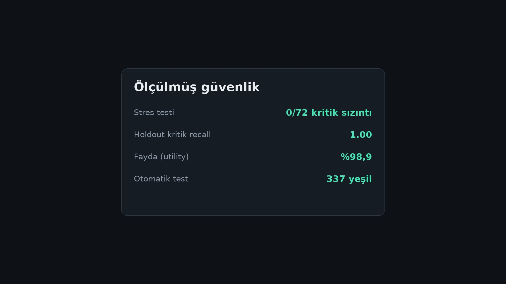

<div align="center">


[](backend/tests)
[](#-benchmark--iddia-değil-sayı)
[](backend/pyproject.toml)
[](#-kurulum)
[](#neden-screenwall)


**[▶ 42 saniyelik tanıtım videosu](screenwall-promo.mp4)** · **[📽 Yatırımcı sunumu (PPTX)](Screenwall-Yatirimci-Sunum.pptx)**

</div>

---

## Neden Screenwall?

Bir sözleşmeyi, bordroyu ya da sağlık raporunu ChatGPT'ye yapıştırdığın an, içindeki
TCKN'ler, IBAN'lar, adlar ve tanılar **geri alınamaz şekilde** dışarı çıkar. KVKK yalnız
şirketlerin sorunu değil: müvekkilinin, müşterinin, çalışanının verisi senin sorumluluğunda.

Screenwall aradaki perdedir: belge **senin makinende** taranır, kişisel veriler deterministik
`<PERSON_1>` etiketlerine çevrilir, yalnız onaylı anonim kopya dışarı çıkar. Sistem emin
olamadığında **otomatik onaylamaz** — belge sana düşer. Güvenlik ayar değil, varsayılandır.

Ve piyasadaki araçların aksine **"bize güven" demiyoruz — sayı veriyoruz** (aşağıda).

## ✨ Özellikler

- 📄 **PDF · DOCX · XLSX** — yapı korunarak: tablolar, üstbilgi/altbilgi, açıklamalar, taranmış sayfalar (OCR)
- 🔍 **3 aşamalı tespit** — Presidio (TR+EN) + 15 özel Türkçe tanıyıcı + yerel Privacy Filter modeli
- 🇹🇷 **Türkçe'ye gerçekten hazır** — checksum'lı TCKN, IBAN, GSM, plaka, sağlık/engellilik terimleri, adres kalıpları, İ/ı-güvenli normalizasyon
- 🔁 **Denetim döngüsü** — kalıntı bulunursa geri beslenir (max 3); şüphede insana düşer (*fail-closed*)
- ↩️ **Tek tıkla geri alma** — yanlış maskelenen terimi UI'dan geri al; belge yeniden taranır
- 🗄 **5 katmanlı depo** — yalnız onaylı anonim katman paylaşılabilir; *destructive* modda orijinal hiç diske yazılmaz (KVKK m.3 anonimleştirme)
- 🔌 **%100 yerel** — onaydan önce tek bir dış çağrı yok; internet bile gerekmez
- 💬 **Onay sonrası sohbet** — anonim kopya üzerinden istediğin LLM'e sor (OpenAI/Anthropic/Ollama)

## 📊 Benchmark — iddia değil, sayı



| Ölçüm | Sonuç | Bu ne demek? |
|---|---|---|
| Stres testi | **0 / 72** | Kişisel veriyi *bilerek saklamaya çalışan* 72 tuzaklı belge hazırladık — satır sonunda bölünmüş numaralar, gizli Excel sayfaları, taranmış (fotoğraf) sayfalar, bozuk dosyalar. **Hiçbirinden tek bir kritik bilgi sızmadı.** |
| Kritik veri yakalama | **%100*** | Sistemin daha önce *hiç görmediği*, cevap anahtarı kilitli tutulmuş belgelerde TCKN, ad, IBAN, sağlık bilgisi gibi kritik verilerin tamamı yakalandı. |
| Belgenin işe yararlığı | **%98,9** | Maskeleme sonrası belge çöpe dönmüyor: belgeye sorulan 280 sorunun %98,9'u anonim kopyadan hâlâ cevaplanabiliyor. Gizlilik var, iş kaybı yok. |
| Sahte kimlik probu | **16/16** | Belgelere 16 sahte kimlik/hesap/anahtar yerleştirdik ("kanarya" yöntemi — madencinin kanaryası gibi erken uyarı). Hepsi, yanında ipucu kelime olmasa bile yakalandı. |
| Otomatik test | **337 yeşil** | Her kod değişikliğinde 337 otomatik kontrol çalışıyor; biri bile kırılırsa değişiklik yayınlanmaz. |

<details>
<summary><b>Nasıl ölçüyoruz?</b> (terimlerin açıklaması)</summary>

- **GoldBench:** 240 gerçekçi ama tamamen sentetik belge (sözleşme, bordro, sağlık raporu…) —
  içindeki her kişisel verinin yeri önceden işaretli. Sistem ne bulması gerektiğini "bilmeden"
  taranır, sonuç cevap anahtarıyla karşılaştırılır.
- **Mühürlü holdout:** Sınavın bir bölümünün cevap anahtarı kilitli tutulur ve sistem
  geliştirilirken o bölüme *hiç bakılmaz*. Böylece "ezberledi mi, gerçekten öğrendi mi"
  sorusu dürüstçe cevaplanır. (*%100 bu bölümün alt-kümesinde ölçüldü — dipnotsuz
  yuvarlamıyoruz.*)
- **Stres korpusu:** Kötü niyetli ya da şanssız gerçek dünya vakalarının simülasyonu:
  bir telefon numarasının iki hücreye bölünmesi, PII'ın sayfa altbilgisine saklanması,
  zip-bomb gibi bozuk dosyalar. Amaç: sistemin "emin değilsem onaylamam" refleksini sınamak.
- **Kanarya probu:** Belgeye bilerek sahte kimlik yerleştirip kaçıp kaçmadığına bakmak.
- **Aşırı-maskeleme probu:** Tersi de ölçülür — kişisel veri İÇERMEYEN 40 sıradan iş cümlesi
  sisteme verilir; gereksiz yere karartılan her cümle hata sayılır (bizde 11/40 — açık kusur,
  aşağıda).
- **Deney günlüğü:** Her iyileştirme denemesi, başarısızlar dahil, ölçümüyle kayıt altında:
  [`thoughts/EXPERIMENTS.md`](thoughts/EXPERIMENTS.md).

</details>

### İki bağımsız sistem, aynı sınav

Kendi sınavımızı kendimiz geçmiş olmayalım diye: bağımsız geliştirilen ikinci bir sistem
(**Sol**) aynı belgeler, aynı sabit kurallar ve bağımsız bir puanlayıcıyla koşuldu.

| Test | Screenwall | Sol | Kim önde? |
|---|---|---|---|
| Kritik veri yakalama | **1.00*** | 0.68 (kural-eşit: 0.86) | Screenwall |
| Aşırı-maskeleme | 0/90 | 0/90 | Berabere |
| Stres kritik sızıntı | **0/72** | 9/72 | Screenwall |
| Gereksiz maskeleme probu | 11/40 | **3/40** | **Sol** — açıkça yazıyoruz |

Sol'un önde olduğu satırı saklamıyoruz; tersine yol haritamıza hedef olarak koyduk.
Sol'un yakalama skoru iki kuralla verildi çünkü Sol kendini bizden daha sert bir kuralla
puanladı; adil karşılaştırma için ikisi de tabloda. Tüm dürüstlük notları (ev-sahibi avantajı,
kural farkları, henüz "ölçülmedi" durumundaki saldırı-direnci testi):
[`docs/CALIBRATION.md`](backend/docs/CALIBRATION.md).

## 🏗 Nasıl çalışır?

Teknik olmayan özet — dört adım:

1. **Yükle:** PDF/Word/Excel belgeni bırakırsın. Belge bilgisayarından çıkmaz.
2. **Tara & maskele:** Üç ayrı dedektör (kural tabanlı + iki yapay zekâ modeli) kişisel
   verileri bulur ve `<PERSON_1>` gibi etiketlerle değiştirir. Biri kaçırırsa diğeri yakalar.
3. **Denetle:** Bağımsız bir denetçi maskeli kopyayı kontrol eder. Kalıntı bulursa sistem
   baştan maskeleyerek tekrar dener (en çok 3 tur). **Hâlâ emin değilse onaylamaz — sana
   sorar.** Otomatik onay ancak denetim temizse gerçekleşir.
4. **Kullan:** Onaylı anonim kopyayı PDF olarak indirir ya da üstünden yapay zekâya soru
   sorarsın. Dışarı yalnız bu anonim kopya çıkar; yanlış maskelenen bir şey olursa tek tıkla
   geri alırsın.

Teknik akış:

```
Yükle ─▶ Doğrula ─▶ Çıkar (yapı korunur) ─▶ ┌── Denetim döngüsü (max 3) ──┐
                                            │  3-aşamalı tespit → maskele  │
                                            │  Denetçi temiz mi? ──hayır──┘
                                            └──── evet ▼
                              ONAYLANDI ◀── insan incelemesi (şüphede)
                                  │
                    anonim PDF indir · onay-sonrası sohbet (yalnız anonim katman)
```

## 🚀 Kurulum

```bash
git clone https://github.com/EminKolac/screenwall.git && cd screenwall

# Backend
cd backend && uv sync
uv run python -m spacy download en_core_web_sm
uv run python -m spacy download xx_ent_wiki_sm
uv run uvicorn app.main:app --reload

# Frontend (yeni terminal)
cd frontend && npm install && npm run dev
```

Tarayıcıda `http://localhost:5173`. Opsiyonel güçlendirmeler (yerel denetçi LLM, Privacy
Filter, sohbet sağlayıcıları): [`docs/DEPLOYMENT.md`](docs/DEPLOYMENT.md).

## 🧪 Ölçümleri kendin koş

```bash
cd backend
uv run python -m evaluation.goldbench.run_gold   --mode mapping --tag benim
uv run python -m evaluation.goldbench.run_stress --mode mapping --tag benim
uv run python scripts/measure_canary.py
```

Korpuslar deterministik üretilir (aynı seed → aynı byte'lar); benchmark kuralları dış
sistemler için de sabittir — bağımsız Sol koşusu bu kurallarla yapıldı.

## 🗺 Yol haritası

- [ ] Çift-tıkla kurulum (teknik bilgi gerektirmeyen başlatıcı)
- [ ] UYAP **UDF** desteği (avukatların gerçek formatı)
- [ ] Kalite modunun 38× yavaşlığını kapatan model optimizasyonu
- [ ] Gereksiz maskeleme: 11/40 → 3/40 (Sol'un çıtası)
- [ ] TRIR saldırı-direnci koşusu (paket hazır, gate dürüstçe "ölçülmedi")

## 📜 Lisans

Henüz lisans seçilmedi — kod inceleme için açıktır; yeniden kullanım izni lisans eklenene
kadar saklıdır. (Yakında.)
